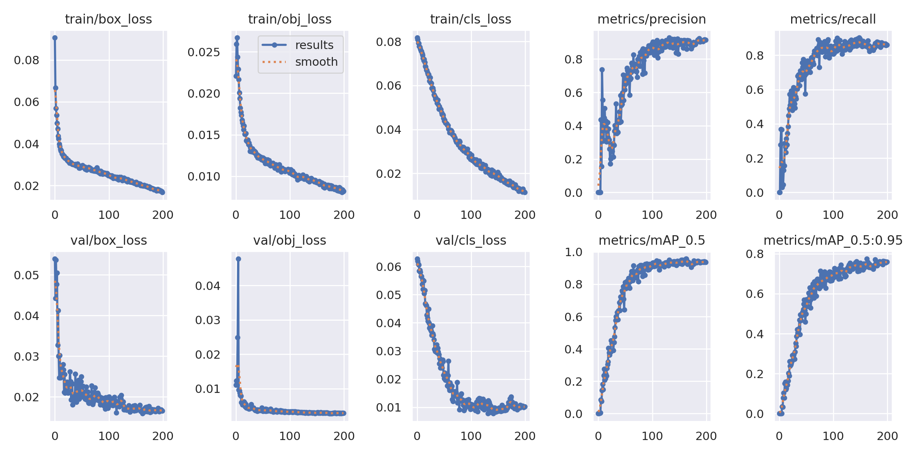

# 🧠 YOLOv5 - American Sign Language (ASL) Letters Detection

This project leverages **YOLOv5** to detect and classify hand gestures of American Sign Language (ASL) letters:

**Supported Gestures:**  
- A  
- B  
- C  
- D  
- E  
- F  
- G  
- H  
- I  
- J  
- K  
- L  
- M  
- N  
- O  
- P  
- Q  
- R  
- S  
- T  
- U  
- V  
- W  
- X  
- Y  
- Z

---

### **Detection:**


---
### **Model Performance:**

<div align="center">



</div>


## 📦 Prerequisites

- Python 3.8+
- `pip` package manager

---

## ⚙️ Setup Instructions

### 1. Clone YOLOv5 Repository

```bash
git clone https://github.com/ultralytics/yolov5.git
cd yolov5
```

2. **Install Dependencies:**

    Make sure you are using Python 3.8. Then, install the required dependencies.

    ```bash
    pip install -r requirements.txt
    ```
    
3. **Prepare Dataset:**

    Organize your dataset into the following folder structure:

    ```
    yolov5/
    ├── Data/
    │   ├── train/
    │   │   ├── images/
    │   │   └── labels/
    │   ├── val/
    │   │   ├── images/
    │   │   └── labels/
    |   └── test/
    |        ├── images/
    │        └── labels/
    |── models/
    └── train.py
    ```

    - Place your training and validation images in `Data/train/images/` and `Data/val/images/`.
    - Place the corresponding annotation files (e.g., `.txt`) in `Data/train/labels/` and `Data/val/labels/`.

4. **Train the Model:**

    To train the model, run the following command:

    ```bash
    python train.py --img 416 --batch 16 --epochs 100 --data "yolov5/Data/data.yaml" --weights yolov5s.pt
    ```

    Here, `data.yaml` is the configuration file that contains paths to the dataset and class labels. You can create a `data.yaml` like this:

    ```yaml
    train: ./Data/train/images
    val: ./Data/val/images
    nc: 26
    names: ['A', 'B', 'C', 'D', 'E', 'F', 'G', 'H', 'I', 'J', 'K', 'L', 'M', 'N', 'O', 'P', 'Q', 'R', 'S', 'T', 'U', 'V', 'W', 'X', 'Y', 'Z']
    ```

5. **Predict using the Model:**

    After training, you can use the model to make predictions on new images:

### Make sure to move run.py and best.pt inside yolov5 clone directory
    
   ```bash
    python detect.py --weights runs/train/exp/weights/best.pt --img 416 --source path_to_your_image_or_directory
   ```

- Replace `path_to_your_image_or_directory` with the path to the image or directory where you want to perform predictions.

## Example Usage

To predict an image (e.g., `test.jpg`):

```bash
!python detect.py --weights runs/train/yolov5s_results/weights/best.pt --img 416 --conf 0.4 --source ./Data/test/images/
```
